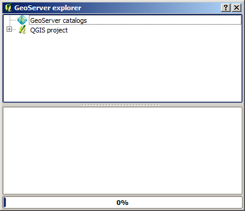
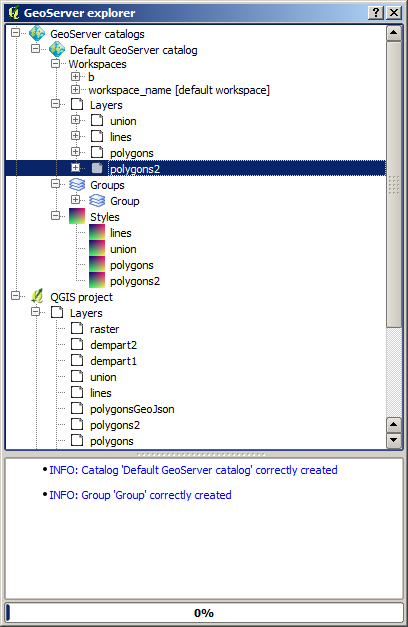

Configuring a GeoServer instance from the QGIS GeoServer Explorer
===================================================================

The GeoServer explorer is used to configure a GeoServer instance from QGIS. You can edit the current elements in the server, and also upload new ones from your current QGIS project. This allows you to easily prepare your data and its stylying with the usual QGIS tools, and then publish it directly from QGIS.

The GeoServer Explorer is launched from the *OpenGeo* menu has the following appearance

It contains a tree with two main branches: *Geoserver catalogs* and  *QGIS project*. 

The first of the contains the catalogs that you are connected to, and with which you can interact from the explorer. It is empty when you start the explorer, and you can add as many connections as you want to it.

The second branch contains the elements of the current QGIS project. These elements, however, are presented with a structure that differs from the QGIS TOC, and resembles the structure of elements in the QGIS. This way, it is easy to understand the relation between both the QGIS project and the GeoserverCatalogs

Most of the functionality of the explorer is accessed through context menus, right--clicking on the elements that you will find in the branches described above

Let's add a connection to a local GeoServer instance (make sure you have a local GeoServer running before doing it). Right--click on the *GeoServer catalogs* item and select *Add new catalog...*. You will see the following screen.

 .. image:: add_catalog.png

Enter the connection parameters for you GeoServer endpoint (the default values are the default Geoserver ones) and click on *OK*. If the connection was succesfull, a new element will be added to the tree, and if you expand it you will see something like this.

Of course, the content will depend on the content of your GeoServer catalog. Each catalog contains 4 entries: *Workspaces, Layers, Layer groups* and *Styles*. The workspaces in the *Workspaces* node contain themselves other elements, like the stores and also the resources (Feature types and coverages) in each store. By right--clicking on these elements, you will get to the functionality related to each of them.

All items can be renamed/deleted/refreshed using the corresponding menu item, which are available in all of them. When deleting an element with dependencies (i.e. a resource that is used in a layer), dependencies will also be deleted, and the user will be prompted to confirm the operation between deleting.

QGIS elements have their commands enabled only if there is at least one GeoServer catalog configured, since they need it (all the available commands upload QGIS data to a GeoServer catalog)

Information about each command run is shown in the text box in the lower part of the explorer dialog.

Here is a list of the other commands available depending on the type of element you click onto.

- GeoServer Feature type/Coverage item.

	- *Add to QGIS project*: Creates a new layer based on the resource. It will create a layer in the current QGIS project which is connected to the GeoServer layer, and will set it with the default QGIS rendering style for the corresponding data type.

	If the layer that is created in the QGIS project is a vector layer, it will be connected to the GeoServer resource using the WFS endpoint. If is is a raster layer it will be a WCS layer. In all cases, no data is downloaded, but a connection is created instead. 
	
- GeoServer workspace item.

	- *Set as default workspace*. Sets this workspace as the default one.

- GeoServer layer item.

	- *Add layer to QGIS project*. Similar to the *Add to QGIS project* command for feature types or coverages, but it also uses the style information in the case of vector layers. Style is downloaded as an SLD file and configured for the corresponding QGIS layer.

	- *Add style to layer*. Adds a new style to the layer from the list of available ones in the catalog. The style is selected from the dialog shown below

	.. image:: add_style.png

	If the layer is under a layer group item, the available commands can be used to re-order layers in the group or remove them.

	.. image:: order_in_group.png

- GeoServer layer group item.

	- *Edit...*. Layers in a goup can be configured through the following dialog.

	.. image:: define_group.png

- GeoServer style item (under layer item).

	- *Set as default style*. Sets the style as the default style for the layer

	- *Add style to layer*. A style can be selected in the dialog that will be shown, and it will be added as an additional style for the layer

- QGIS layer item

	- *Publish...*. Publishes the layer to a GeoServer catalog. It creates a store and resource, and a layer based on it. If the layer is a vector layer, the corresponding styling defined in QGIS or that layer will be published and used for the layer. The catalog and workspace are selected in a dialog like the one shown below

	.. image:: publish_layer.png

	When publishing a layer this way, you do not have to worry about the layer origin. The plugin code will take care of converting your data to a suitable format to be uploaded to GeoServer. If the current format of the layer is not supported, an intermediate Shapefile will be created, and then used to create the corresponding datastore from which the layer will then be published.

	If you try to publish a QGIS layer that is based on a PostGIS connection, a PostGIS datastore will be created, instead of a file--based one. 

	- *Create store from layer*. Like the command above, but it does not publish or use the styling. In the case of raster layers, it has the same behaviour as the *Publish...* command

- QGIS group item

	- *Publish*. Publishes the selected group. If layers with the names of the layers in the group already exist in the destination catalog, they will be used and the data from the corresponding QGI layers will not be used. Otherwise, layer belonging to the QGIS group to publish will be published as well.

- QGIS style item

	- *Publish*. Publishes the selected style. Since only vector layers suport SLD in QGIS, raster layers are not listed in this group.

You can select multiple elements of the same type (i.e. multiple QGIS layers), to automate operations. For instance, let's say that you have several layers in your current project. Select them all (click while pressing the Ctrl or Shift keys) and then right--click and select *Publish...*. You will get see to a dialog like the following one.

.. image:: multi_publish.png

Configure the catalog and workspace you want to upload each layer to, and a multiple upload will be executed.

