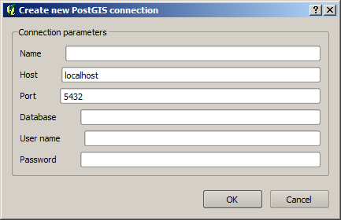

OpenGeo Suite QGIS plugin Quickstart
======================================

This quickstart will guide you through some of the most usual task that can be performed using the OpenGeo Suite QGIS plugin.

You should have a local GeoServer instance running, and a PostGIS database. The examples in this quickstart assume that both of them are available with the usual parameters set by a fresh OpenGeo Suite installation (``localhost:8080/geoserver/`` for GeoServer, port 54321 for PostGIS). Adapt the examples as needed, in case you are running your GeoServer or PostGIS with a different configuration.

Example data used in this quickstart is available `here <>`_

To start, let's open the OpenGeo explorer, using the *OpenGeo* menu. It will appear on the right--hand side of your QGIS window.

You will see that the *GeoServer catalogs* entry is empty. Select it and then click on the *New catalog* button that will appear on the toolbar in the upper part of the explorer window (the buttons in the toolbar change depending on the type of element selected in the tree). The catalog creation dialog contains the default parameters for a local GeoServer instance. 

.. image:: create_catalog.png

Since that is what we want to configure, there is no need to modify those values, so just click on *OK*. The new catalog will appear on the corresponding branch

.. image:: catalog_entry.png

We are going to publish some data into that catalog, so the first thing to do is to create a workspace where we can put our data. Select the *Workspaces* entry and then click on the *New workspace* in the toolbar.

Fill the dialog text boxes with the inputs shown above and click on *OK*. The workspace whould now appear in the list of available ones. It's not however, the default workspace. Let's make it the default workspace by selecting the workspace item, right--clicking on it and then selecting *Set as default workspace*. This will make the next tasks a bit easier, since our recently created workspace will be used by default for some of the operations we are going to perform.

Open the QGIS project that is included in the example data. You should have 10 layers in your project, with two groups defined.

.. image:: project.png

We are going to publish the project as it is, with those layers and groups, and with the symbology that is associated to each layer (which is actually the same for all layers in each group). Normally, it would be your task to add the corresponding layers to your project and set their simobology, and also to create groups if needed. In this case, we are providing the project already configured, for the sake of smiplicity. The idea is to show that you can do all the work in QGIS, and then just replicate you configuration and data in the GeoServer catalog, by publishing into it.

To publish the project as it is, just select the *QGIS project* entry in the eexplorer tree, and then click on *Publish...*

.. image:: publish_project.png

Select the *quickstart* workspace as the destination workspace.
Apart from the groups contained in the current QGIS project, an additional group can be created with all the uploaded layers. Since we do not want that in this case, leave the *Create global group* box unchecked. Click on *OK* and the publishing process should start. You can track it's progress in the progress bar in the lower part of the explorer window.

Once it is finished, your catalog should look like this. 

.. image:: catalog_after_publish.png

As you can see, a store has been created for each QGIS layer, and also the corresponding GeoServer layers and styles. Layers have been configured to use the corresponding styles.

The sample dataset contains a shapefile named ``roads6.shp`` that is not included in the QGIS project. We will add it as well, since we want it to be published along with the other ones. 

There is not need to open the layer in QGIS. Just open the QGIS browser, and locate the shapefile in it. Now select it and drag and drop it onto the catalog item in the tree. 

.. image:: drag_file.png

Since *quickstart* is the default workspace, it will be added to that workspace. If you want to publish into another one, just drop it on the corresponing workspace item instead of the catalog one.

A layer has also been created, but this time it has no associated style, since it was created directly from the shapefile, which has no styling itself. Since the layer should have the same style as the other roads layers, there is no need to upload a new style, we can just reuse one of the uploaded stlyes (which are actually the same, and are repeated, one for each layer). To do it, just select the GeoServer style to use, and then drag and drop it onto the layer without style that we have just pubished. The style should be assigned.

.. image::style_assigned.png

Make it the default style by selecting it and clicking on the *Set as default style* button.

.. image:: default_style.png

There are other ways to publish our data. Instead of creating GeoServer layers that are based on shapefiles, we can import those shapefiles into a PostGIS database, and then create layers based on that database. To do it, first create a *quickstart* database (you have to do that outside of QGIS, using the command line or the PgAdmin utility). Now connect to it from the explorer, right-clicking on the *PostGIS connections* item and selecting *New connection*

Set the parameters of the connection and click on *OK*. The connection should appear in the explorer tree.

.. image::connection.png

Now click on the schema where you want to import your data, and select *Import files...*. The following dialog will appear.

.. image:: import_to_postgis.png

Click on the button in the upper part of the dialog to select the files to import. Add the ``roadsX.shp`` files. Set the name of the destination table to *roads*, and check the *add to layer* box. This will cause all files to be imported to a single table named *roads*. The dialog should look like this.

.. image:: import_to_postgis2.png

click on OK and the data will be imported in the specified table.

Now, to create a GeoServer layer with that table, you can drag and drop the table into the workspace item, just like you did when importing the shapefile. 

The resulting GeoServer layer will also have no style associated. You can solve that by dropping a style onto it, as we have already seen.

Once the data is in our GeoServer catalog (whether in the form of several shapefile-based stores or a single PostGIS-based store), we can also use the explorer to seed the cached layer that is automatically created upon importing. In the *GeoWebCache* entry of your catalog, you should have something like this.

..image:: gwc.png

Click on the layer that correspond to the PostGIS-based layer that we have just created, and select *Seed...*. You will see a window to define the seeding to perform, which should be filled as follows.

.. image:: seed.png

Click on OK an the seeding request will be sent to your GWC instance. The description panel of the GWC layer will change to reflect that a seeding operation has been launched. The description is not updated automatically, but you can click on the *update* hyperlink to refresh it and see how it progresses.

