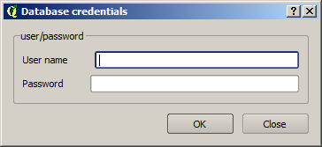
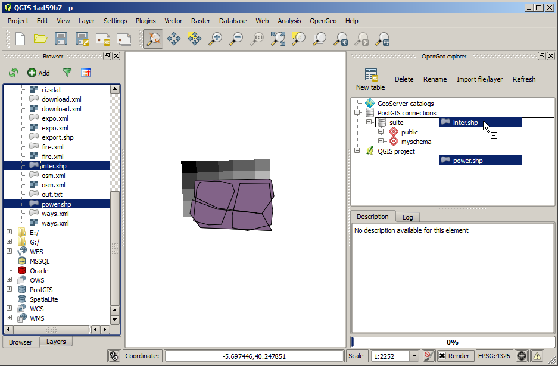

.. _actions:

Available commands and actions
===============================

This document contains a listing of available actions in the OpenGeo Explorer.

Context menu actions
*********************

Below you can find more detailed information about commands available depending on the type of element you click onto in the OpenGeo Explorer, and a more detailed explanation about how to use them.

GeoServer
----------

- GeoServer Catalog item.

	- *Clean (remove unused elements). Cleans all styles in the catalog that are not used by any layer, and all stores that are not published through any layer.

- GeoServer Feature type/Coverage item.

	- *Add to QGIS project*: Creates a new layer based on the resource. It will create a layer in the current QGIS project which is connected to the GeoServer layer, and will set it with the default QGIS rendering style for the corresponding data type.

		If the layer that is created in the QGIS project is a vector layer, it will be connected to the GeoServer resource using the WFS endpoint. If is is a raster layer it will be a WCS layer. In all cases, no data is downloaded, but a connection is created instead. 

- GeoServer workspace item.

	- *New workspace...*. Adds a new workspace.

	- *Clean (remove unused stores)*. Removes all data stores that are not published through any layer in the catalog.

- GeoServer workspace item.

	- *Set as default workspace*. Sets this workspace as the default one.

- GeoServer layer item.

	- *Add layer to QGIS project*. Similar to the *Add to QGIS project* command for feature types or coverages, but it also uses the style information in the case of vector layers. Style is downloaded as an SLD file and configured for the corresponding QGIS layer.

	- *Add style to layer*. Adds a new style to the layer from the list of available ones in the catalog. The style is selected from the dialog shown below

		.. image:: img/actions/add_style.png
			:align: center

	If the layer is under a layer group item, the available commands can be used to re--order layers in the group or remove them.

	.. image:: img/actions/order_in_group.png
		:align: center

- GeoServer layer group item.

	- *Edit...*. Layers in a group can be configured through the following dialog.

	.. image:: img/actions/define_group.png
		:align: center

- GeoServer styles item

	- *New style from QGIS layer*. Creates a new style in the GeoServer catalog, using the style of a QGIS layer. The QGIS layer to use and the name of the style to create in the GeoServer catalog are specified in the following dialog.

	.. image:: img/actions/new_style.png
		:align: center

	- *Clean (remove unused styles)*. Removes all styles that are not being used by any layer.

	- *Consolidate styles*. Searches for layers in the catalog that have different styles that correspond to the same simbology. This might happens when uploading layers with the same style, since each uploaded layer will have its own layer with the same name as the layer, and all of them will share the same SLD code. This command find those styles that represent the same symbology, and in the layers that use them, replaces the corresponding styles with the first style in the list of redundant ones. After the command has been run, only one style of those that are identical will be in use, while the remaining ones will not be used by any layer. Those unused styles are not removed, but calling the *Clean (remove unused styles)* comand will remove then from the catalog.

- GeoServer style item.

	- *Edit...*. Opens the QGIS symbology editor to edit the style of the layer. Create your symbology and accept the dialog to close. This will cause the style to be updated. Notice that the QGIS interface for defining a symbology is used to edit a GeoServer style, but since the layer that uses the style is not available, some restrictions exist:

		If the style item is under a layer item, the Explorer will get the attribute names of the layer, so you can use them for defining your symbology rules. The min and max values of those attributes in the layer are, however, not available, so you will not be able to use them to define ranges or categories.

		If the style item is not under the layer item, the Explorer  will try to find out if the style is used by any layer, and will use that layer in case it can find it. If several layers are using a style, the first one of them will be used. If no layer is found (no layer is using that style), the style will be opened for editing, but no field names will be available. You will be editing the style as if it corresponded to a QGIS layer with no attributes.

		Labeling is not supported in this case when fetching the SLD style to edit. That means that you can add labeling to the style you define, and it will get correctly uploaded to the catalog, but if the style you are editing has some kind of labeling defined, it will not appear on the QGIS style editor, which will always has labeling disabled.

	- *Edit SLD...* option. By clicking on it you can directly edit the content of the corresponding SLD, using a dialog with an XML editor, such as the one shown below.

		.. image:: editsld.png
			:align: center

		Clicking on *OK* will update the corresponding SLD body in the catalog, with the current text of the editor. No validation is performed on the client side, but if the content of the editor is not a valid SLD, GeoServer will refuse to update it. The corresponding error message returned by GeoServer will be shown in the QGIS message bar.

		.. image:: sld_error.png
			:align: center

	If the layer is under a layer item, the following additional options are available.

		- *Set as default style*. Sets the style as the default style for the layer.

		- *Add style to layer*. A style can be selected in the dialog that will be shown, and it will be added as an additional style for the layer.

		- *Remove style from layer*. Removes a style from the list of alternatives styles of the layer. Not enabled for the default style of the layer. 		

- Settings item. The *Settings* item contains no children. Instead, when you click on it, it will display all configurable parameters in the description panel. You can edit them there and then press the *Save* button to upload changes to the corresponding catalog and update it.

GeoWebCache
-------------

- GeoWebCache layers

	- *New GWC layer...*. Adds a new GWC layer from an existing layer in the GeoServer catalog. The properties of the cached layer are defined in a dialog like the one shown below.

	.. image:: img/actions/define_gwc.png
		:align: center

- GeoWebCache layer.

	- *Delete*. Removes the cached layer

	- *Edit...*. Allows to change the properties of the GWC layer, by opening the same dialog used to define them when creating the layer.

	- *Seed...*. Launches a seeding operation for the cached layer. The operation is defined through the following dialog.

		.. image:: img/actions/seed.png
			:align: center

		The area to seed has to be entered in the box in the bottom part of the dialog, with a string of 4 comma-separated values (xmin, xmax, ymin, ymax). If no values are entered, the full extent of the layer to seed is used.

		Another way of setting the seeding region is to click on the *Define on canvas* button on the right--hand side of the extent box. This will cause the dialog to temporarily this appear and show the QGIS canvas. Just click and drag on the canvas to define the desired seeding region, and the dialog will show up again, containing the coordinates of the region.

		.. image:: img/actions/extent_drag.png
			:align: center

	- *Empty*. Deletes (truncates) all cached data for a given layer.

		When a seeding operation is started, the description box corresponding to the GWC layer being seeded will show the current state of the operation. 

		.. image:: img/actions/seed_status.png
			:align: center

		Since this operations might be very long, depending on the selected zoom levels and the area covered by the layer, progress in this case is not shown using the normal progress bar and hourglass mouse pointer. 

		Instead, you can use QGIS as usual while the operation is running in the background, and to update the status, just click on the *update* link in the description box to get the current number of processed tiles. If you want to stop the seeding operation, just click on the *kill* link.

PostGIS
----------

The functionality in the PostGIS branch is similar to that of the QGIS DB Manager, but with some additional operations and integrated with the other elements that can be managed from the OpenGeo explorer. It contains the list of connections currently available in QGIS. If passwords were not stored when the DB connection was created, the connection will not be possible, and the corresponding tree element will not be populated with the available schemas. This is indicated with a different icon in the connection element.

.. image:: img/actions/wrong_db.png
	:align: center

To reconnect a wrong connection, select the *Refresh* option. You will be prompted for the username and password, and a new attemp will be made to conenct to the PostGIS database.

The following actions are available for items in the PostGIS branch.

- PostGIS connections item

	- *Add new connection*. Adds a new PostGIS connection. The connection is not defined through the usual QGIS connection dialog, but a custom one instead.

		.. image:: img/actions/new_pg_connection.png
			:align: center

		At the moment, this dialog does not allow to configure all the parameters that can be set up through the built-in dialog. Also, passwords and user names are always stored in this case. If this doesn't fit your needs, please, create the new connection through the usual interface, using the *Add PostGIS layers* ad then creatig a new connection. After doing it, refresh the *PostGIS connection* entry in the OpenGeo explorer, since it will not be automatically updated.

- PostGIS connection item

	- *New schema*. Creates a new schema.

	- *Import files*. Import a set of files with data into the selected schema. The following window is shown.

		 .. image:: img/actions/import_postgis.png
		 	:align: center

		 Click on the button in the *Layers* group and select the files you want to import. Then select the destination schema and table. You can select the name of a preexisting table or enter the name you want. In case of selecting a preexisting table, click on the *Add to table* checkbox to add the imported data to the current content of the table. Otherwise, the table will be deleted and a new one with that name created. If you select the *Add to table* box, data will only be imported if the feature type of the file to import matches the table feature type. If not, an error message will be shown in the log window and the corresponding file will not be imported.

		 There is an additional option, *[use file name]*, which will set the table name based on the name of the file to import (without extension). The *Add to table* box applies also in this case.

		 When two or more files are selected, the *Add to table* box will automatically be checked in case a table name option other than *[use file name]* is selected. In this case, it makes no sense to overwrite the destination table, since all imported files are going to be imported into the same table, and that will cause each one to overwrite the previous ones, leaving in the final table just the content of the last file.

	- *Run SQL...*. Run a SQL sentence on the database. Calling this method will show the DB-manager SQL dialog, where the query can be written or a saved one can be open.

		.. image:: img/actions/sql_dialog.png
	 		:align: center

- PostGIS schema item

	- *New table*. Creates a new table. Creates a new table with the specified structure. The table definition is done in the following dialog.

		.. image:: img/actions/create_table.png
			:align: center

	- *Delete*. Deletes the schema. It has to be empty to be removed. Otherwise, PostGIS will refuse to delete it.

	- *Rename*. Renames the schema.

	- *Import files*. Same as the import command for connection items, but the schema field in the import dialog is not enabled.

- PostGIS table item

	- *Delete*. Deletes the table.

	- *Rename*. Renames the table.

	- *Run vacuum analyze*. Vacuums the table

QGIS project
--------------

- QGIS layer item

	- *Publish...*. Publishes the layer to a GeoServer catalog. It creates a store and resource, and a layer based on it. If the layer is a vector layer, the corresponding styling defined in QGIS or that layer will be published and used for the layer. The catalog and workspace are selected in a dialog like the one shown below

		.. image:: img/actions/publish_layer.png
			:align: center

		When publishing a layer this way, you do not have to worry about the layer origin. The plugin code will take care of converting your data to a suitable format to be uploaded to GeoServer. If the current format of the layer is not supported, an intermediate Shapefile will be created, and then used to create the corresponding datastore from which the layer will then be published.

		The name of the layer in the QGIS TOC will be used as name for the resource, layer and corresponding. If elements exist with those names, they will be overwritten

		If you try to publish a QGIS layer that is based on a PostGIS connection, a PostGIS datastore will be created, instead of a file--based one. A feature type corresponding to the layer to publish will be created for that datastore. If a PostGIS datastore with the same name and connection parameters already exist, no new datastore is created, and the featuretype will be directly created under it. This allows to publish several layer based on a single PostGIS connection. The name of the datastore will be the name of the corresponding QGIS PostGIS connection, and the name of the featuretype will be the name of the layer.

		The current symbology is used to create a style that is layer used from the published the layer. In the case of raster layers, since QGIS does not support SLD styling of raster layers, the symbology is not used. A default style is used instead. In the case of 3--band images, a RGB style is used. In the case of single--band layers, a grayscale style is used.

	- *Create store from layer*. Like the command above, but it does not publish or use the styling. 

- QGIS group item

	- *Publish*. Publishes the selected group. If layers with the names of the layers in the group already exist in the destination catalog, they will be used and the data from the corresponding QGIS layers will not be used. Otherwise, layers belonging to the QGIS group to publish will be published as well.

	The command will first ask you to select a catalog, in case there are several catalogs currently configured. Then, it will check the layers in the selected catalog, to see if there are missing layers. If so, the layer publish dialog will be shown, containing the layers that have to be published before the group can be created.

- QGIS style item

	- *Publish*. Publishes the selected style. Since only vector layers support SLD in QGIS, raster layers are not listed in this group.

- QGIS project item

	- *Publish*. Publishes all the layers in the project. The publish operation is configured through the following dialog.

		.. image:: img/actions/publish_project.png 
			:align: center

		All layers will be published to the selected workspace. If there are groups in the QGIS project, they will also be created.

		If you want to create a group containing all the published layers, enter its name in the *Global group name* textbox. Otherwise, leave it empty and the global group will not be created.

Multiple selection
*******************

You can select multiple elements of the same type (i.e. multiple QGIS layers), to automate operations. For instance, let's say that you have several layers in your current project. Select them all (click while pressing the Ctrl or Shift keys) and then right--click and select *Publish...*. You will get see to a dialog like the following one.

.. image:: img/actions/multi_publish.png
	:align: center

This is the same dialog that appears in case of publishing a group to a GeoServer catalog, as it was already described.

Configure the catalog and workspace you want to upload each layer to, and a multiple upload will be executed.

Another task than can be done with a multiple selection is creating a new group. Just select a set of layers, right--click on them and select *Create group...*. A new group will be created with those layers, using the default style of each of them.

Double-clicking on tree items
******************************

Cetain items respond to double-clicking. If the corresponding element can be edit, the edition can be started by double clicking on it instead of using the corresponding context menu entry. For instance, double clicking on a GeoServer group item will open the dialog to define the layers that are included in that group.

Drag & drop operations
***********************

The explorer tree supports drag & drop, and you can use it to relocate elements, publish data or edit the configuration of an element. 

.. image:: img/actions/dragdrop.png
	:align: center

Below you can find more information about the operations that can be performed this way.

- Dragging a QGIS layer item onto a GeoServer item element. It will publish the layer on the workspace where the item was dropped, or on the parent workspace if the destination element is of type Resource/Store. Otherwise, it will publish to the default workspace
- Dragging a GeoServer layer item onto a GeoServer group element. It adds the layer to the group, using its default style.
- Dragging a GeoServer or QGIS style item onto a GeoServer layer. It adds the style to the list of alternative styles of the layer.
- Dragging a QGIS style into the *Styles* element of a catalog or a catalog item itself. It adds the style to that catalog.
- Dragging a QGIS style into a GeoServer layer element. It publishes the style to the catalog the layer belongs to, and then adds the style to the list of alternative styles of the layer.
- Dragging a QGIS group element into the *Groups*, *Workspaces*, *Layers* of a catalog, or the catalog item itself. The group is published and all layers that do not exist in the catalog and need to be published as well, their corresponding stores will be added to the default workspace. If dropped on a workspace item, that workspace will be used as destination.
- Dragging a GeoServer layer item onto the *GeoWebCache layers* item of the same catalog. It will add the corresponding cached layer for the dragged layer.
- Dragging a QGIS layer into a PostGIS connection or schema item. It will import the layer into the corresponding PostGIS database. The import dialog is shown before importing.
- Draggin a PostGIS table item into a GeoServer catalog or workspace item. It will publish a new layer based on that table, using the item workspace or the default workspace in case of dropping onto a catalog item

Multiple elements can be selected and dragged, as long as they are of the same type.

You can also drag elements from elements outside of the explorer itself. For instance, you can open the QGIS browser, select some files with vector data and drag and drop them into a PostGIS element in the explorer. That will cause the data in those files to be imported into the corresponding PostGIS database.

In general, any operation that can be performed dragging a QGIS layer item within the Explorer tree can also be performed draggin an element in the QGIS browser that represents a layer.

Also, elements from the explorer can be dropped onto the QGIS canvas. GeoServer layers can be dropped onto the QGIS canvas to add them to the project. The corresponding WFS/WCS layer will be created as in the case of using the *Add to QGIS project* menu option, already described. Notice that, however, the style of the layer will not be used in this case, and the layer that will be added to the QGIS project will have a default style assigned to it.

Dragging and dropping a PostGIS table will cause a new layer to be added to the QGIS project, based on that table.

