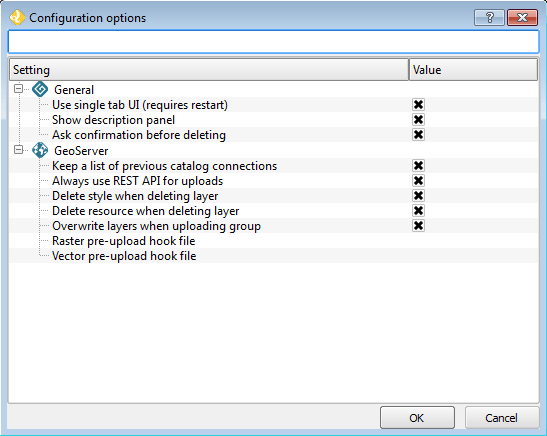
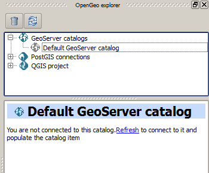

.. _config:

Configuration
=============

In the OpenGeo menu, along with the entry that starts OpenGeo Explorer, you will find an entry that opens the OpenGeo Explorer configuration dialog called :guilabel:`OpenGeo Explorer settings`.

.. figure:: ../actions/img/plugin_menu.png

   OpenGeo Explorer menu

The properties that can be configured are described in detail below.

Use single tab UI
-----------------

By default, OpenGeo Explorer shows all categories (GeoServer Catalogs, PostGIS Databases, and QGIS Project) in a single panel as branches in a tree. If you enable the multi-tab user interface, each category is put in a separate tab, with a tree of elements belonging to the corresponding category, as shown in the next figure.

.. figure:: img/multi-tab.png

   Multi-tab interface

Subcategories (such as layers or workspaces, in the case of a GeoServer catalog) can be accessed using the buttons on the lower part of the panel.

All other functionality is identical, though drag and drop functionality is limited to elements within the same category.

QGIS will need to be restarted for this change to take effect.

Show description panel
----------------------

This option will toggle whether the Description panel at the bottom (or side) of the plugin interface is shown. By default, this is checked.

Ask confirmation before deleting
--------------------------------

It is possible to make changes to the various connected servers and databases, including making deletions. When this option is checked, a dialog will show asking for confirmation before any deletions will happen.

.. warning:: It is highly recommended to keep this box enabled to prevent unintended loss of data.

.. _gs_connections:

Keep a list of previous GeoServer connections
---------------------------------------------

Enabling this option will cause all connection information will be preserved between QGIS sessions.

Subsequent launching of QGIS and OpenGeo Explorer will show the Catalogs item populated with previous connections.

While the connection information is stored, catalog data is fetched only on request. Unpopulated catalogs are shown with a gray icon; Refresh the catalog item to populate it. 

   Previous saved connections shown in gray

If the catalog uses basic authentication, the password will not be stored. You will be prompted to enter it when you reconnect to the catalog. If the *Configurations* tab is used, connection data (wheter password or certificate-based) will be stored in the encrypted QGIS auth database. You will be prompted to enter the master password in case you haven't used the auth database in the current QGIS session.

To know more about how to use authentication configurations in QGIS, see the `Authentication configurations <./auth.html>`_ section

To delete a catalog from the list of previous connections, use the :guilabel:`Remove` option of the catalog item in the Explorer tree.

Always use REST API for uploads
-------------------------------

This option currently has no effect. All uploads are done using the REST API.

.. .. note:: The importer API is currently disabled in the OpenGeo Explorer, and changing the value of the parameter will have no effect at all. All uploads are done using the REST API.

.. By default, layers are uploaded to a GeoServer catalog using the GeoServer REST API. As an alternative, the importer API can be used to provide a better and more responsive upload, specially in the case of large uploads with multiple layers or when large layers are being uploaded.

.. OpenGeo Suite 4.0 includes the importer API by default, but an independent GeoServer instance normally does not contain it, even if it is a recent version that is supported by the Explorer plugin. Make sure that you are running OpenGeo Suite or that you have manually installed the importer API on your GeoServer before setting this configuration parameter. 

Delete style when deleting layer
--------------------------------

Layers in GeoServer must have a default style associated with it. It is possible to delete the layer without deleting the style though, to save the style for use with other layers.

When enabled, this option will delete the default style associated with the layer when the layer is deleted through OpenGeo Explorer, and when that style is not used by any other layer.

Delete resource when deleting layer
-----------------------------------

When this option is checked, the resource that is part of a layer will also be deleted from its corresponding store if the layer is deleted.

.. todo:: Add more details.

Overwrite layers when uploading group
-------------------------------------

When this option is enabled, OpenGeo Explorer will overwrite layers in the GeoServer catalog on upload, if a layer with the same name exists. 

When this option is not enabled, if a layer with the same name already exists in GeoServer, it will be used, and the corresponding QGIS layer will not be uploaded.

Pre-upload processing hooks
---------------------------

If you need to process your data before it is uploaded, you can set up a pre-upload hook that will be run on any layer before it is sent to GeoServer. Instead of the original layer, the result of that hook will be uploaded.

Pre-upload hooks are defined separately for raster and vector layers. In both cases, they are defined as the path to a processing model (``.model``) or script (``.py``) file. The algorithm defined by that hook file will be loaded and executed to obtain the final layer to upload.

.. note:: Please refer to the `Processing chapter in the QGIS manual <http://docs.qgis.org/latest/en/docs/user_manual/processing/index.html>`_ to learn more about the creation of processing models and scripts.

For raster layers, the hook algorithm must have both input and output be of type raster layer. For vector layers, both input and output must be of type vector layer. If the selected model does not exist or does not have the required characteristics, it will be ignored, and the original layer will be uploaded without any preprocessing.
