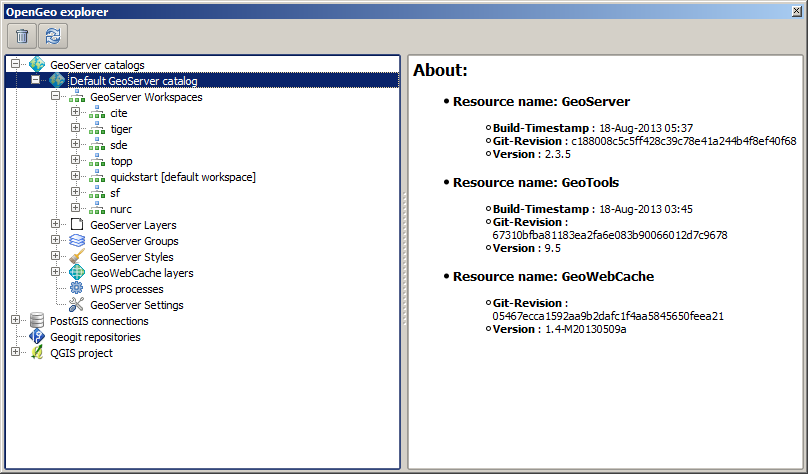

Introduction. Configuring/Using the OpenGeo Suite from QGIS
===================================================================

The OpenGeo Suite Explorer is used to configure the components of the OpenGeo Suite from QGIS. It allows you to easily configure your OpenGeo Suite, for instance preparing your data and its styling with the usual QGIS tools, and then publishing it directly from QGIS to GeoServer. This document describe how to use the OpenGeo Explorer and the operations that it supports for interacting with Suite components.

Version support and limitations
********************************

This plugin is targeted at the elements of the OpenGeo Suite, and it is tested with the versions of those element included in the latest release of the Suite (4.0). However, you can use most of the functionality if you are using individual installations of elements such as GeoServer and PostGIS.

The current version of the plugin is targeted at GeoServer 2.3.x. If you are using an older version, you might encounter some problems, and some elements might not be correctly configured due to differences in the way they are handled by GeoServer or in changes in the REST API that the plugin uses to communicate with GeoServer. Although most things should work fine if connecting to a GeoServer 2.2.x catalog, the following are some of the incompatibilities that have been detected.

- Empty groups. Layers belonging to a group are not found, since the group definition has a different structure
- Styles belonging to a given namespace are not found. Only styles with no namespace are reported if using GeoServer 2.2.x

To check the version of your catalog, just select the catalog in the tree and look at the description tab. 

.. image:: img/intro/about.png
	:align: center

If you do not see information like that, it is likely that your catalog uses a GeoServer version that doesn't support that operation. In this case, it will not support the other operations that cause problems, so you will probably find some issues when working with the catalog through the plugin.

When connecting to a catalog, the explorer tries to check the version. If it cannot detect the version or it cannot confirm it is the target version, it will ask you before adding the catalog.

.. image:: img/intro/version_warning.png
	:align: center

Another important limitation is due to the different versions of the SLD standard that QGIS and GeoServer support. To increase compatibility between them, specific routines have been added to the plugin code. However, in some cases, a style defined in QGIS might not be compatible with the elements supported by GeoServer, and publishing a layer will be done without publishing the corresponding style, but using a default one instead.

This problem exist even when using the Suite GeoServer, but older versions of GeoServer might show more incompatibilities and not validate a large part of the SLD produced by plugin.

Basic labeling is supported, but not all labeling will be exported from QGIS to SLD and uploaded to GeoServer. In particular, advanced data-dependent labeling, is not supported.

Usage
******

The OpenGeo Suite explorer is launched from the *OpenGeo* menu and it looks like this.

.. image:: img/intro/explorer.png
	:align: center

The main element of the explorer is the explorer tree. It has the following main branches, each of which deals with a different component.

- GeoServer catalogs
- PostGIS connections
- QGIS project

A *GeoWebCache* branch is found under the *Geoserver catalogs* branch, since GeoWebCache is integrated into GeoServer.

The *GeoServer catalogs* branch contains the catalogs that you are connected to, and with which you can interact from the explorer. It is empty when you start the explorer, and you can add as many connections as you want to it.

The *QGIS Project* branch contains the elements of the current QGIS project. These elements, however, are presented with a structure that differs from the QGIS TOC, and resembles the structure of elements in GeoServer. This way, it is easy to understand the relation between both the QGIS project and the GeoServer Catalogs.

The *PostGIS databases* branch contains a list of all available PostGIS connections in QGIS. Its functionality resembles that of the QGIS built--in DB Manager.

In the lower part to will see a panel which shows the description of the currently selected item. When the explorer window is docked, the description panel is found on its lower the lower part. If you undock the window, it will be placed on the right--hand side of it, to make better use of the available space. The image below shows the undocked configuration.

The description panel shows information about the currently selected element, but also contains links to actions that affect or are related to the current element. As an example, below you can see the description panel corresponding to a GeoServer layer element.

.. image:: img/intro/description_panel.png
	:align: center

Use the hyperlinks to perform the corresponding actions based on the current element.

The description tab can also show tables where parameters can be edited. The one shown below corresponds to the *Settings* element of a GeoServer catalog.

.. image:: img/intro/description_table.png
	:align: center

Most of the functionality of the explorer is accessed through context menus, right--clicking on the elements that you will find in the branches described above. Also, when you select an element in the tree, buttons in the toolbar in the upper part of the explorer window are updated to show the available actions for that element. These actions correspond to the ones shown in the context menu when you right--click on the element, so you have different ways of accesing the same funcionality. As it was explained before, the *Description* panel is also interactive.

To start working with the explorer and know more about how to use it, check the :ref:`quickstart` page. For a more complete reference, a detailed description of all the available actions for each kind of element in the Explorer tree is available at the :ref:`actions` section.

