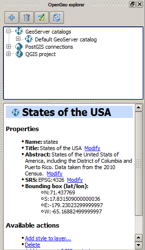
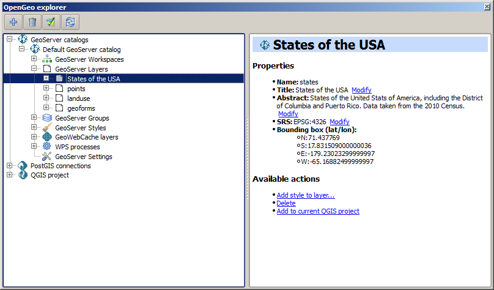
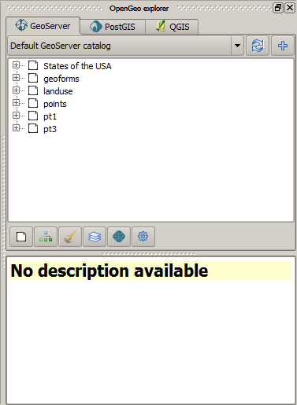

Introduction. Configuring/Using the OpenGeo Suite from QGIS
===================================================================

The OpenGeo Suite Explorer is used to configure the components of the OpenGeo Suite from QGIS. It allows you to easily configure your OpenGeo Suite, for instance preparing your data and its styling with the usual QGIS tools, and then publishing it directly from QGIS to GeoServer. This document describe how to use the OpenGeo Explorer and the operations that it supports for interacting with Suite components.

Version support and limitations
********************************

This plugin is targeted at the elements of OpenGeo Suite, and it is tested with the versions of those element included in the latest release of the Suite (4.0). However, you can use most of the functionality if you are using individual installations of elements such as GeoServer and PostGIS.

The current version of the plugin is targeted at GeoServer 2.3.x. If you are using an older version, you might encounter some problems, and some elements might not be correctly configured due to differences in the way they are handled by GeoServer or in changes in the REST API that the plugin uses to communicate with GeoServer. Although most things should work fine if connecting to a GeoServer 2.2.x catalog, the following are some of the incompatibilities that have been detected.

- Empty groups. Layers belonging to a group are not found, since the group definition has a different structure
- Styles belonging to a given namespace are not found. Only styles with no namespace are reported if using GeoServer 2.2.x

To check the version of your catalog, just select the catalog in the tree and look at the description tab. 

.. image:: img/intro/about.png
	:align: center

If you do not see information like that, it is likely that your catalog uses a GeoServer version that doesn't support that operation. In this case, it will not support the other operations that cause problems, so you will probably find some issues when working with the catalog through the plugin.

When connecting to a catalog, the explorer tries to check the version. If it cannot detect the version or it cannot confirm it is the target version, it will ask you before adding the catalog.

.. image:: img/intro/version_warning.png
	:align: center

Another important limitation is due to the different versions of the SLD standard that QGIS and GeoServer support. To increase compatibility between them, specific routines have been added to the plugin code. However, in some cases, a style defined in QGIS might not be compatible with the elements supported by GeoServer, and publishing a layer will be done without publishing the corresponding style, but using a default one instead.

This problem exist even when using the Suite GeoServer, but older versions of GeoServer might show more incompatibilities and not validate a large part of the SLD produced by plugin.

Basic labeling is supported, but not all labeling will be exported from QGIS to SLD and uploaded to GeoServer. In particular, advanced data-dependent labeling, is not supported.

Usage
******

The OpenGeo Suite explorer is launched from the *OpenGeo* menu and it looks like this.

The main element of the explorer is the explorer tree. It has the following main branches, each of which deals with a different component.

- GeoServer catalogs
- PostGIS connections
- QGIS project

A *GeoWebCache* branch is found under the *Geoserver catalogs* branch, since GeoWebCache is integrated into GeoServer.

The *GeoServer catalogs* branch contains the catalogs that you are connected to, and with which you can interact from the explorer. It is empty when you start the explorer, and you can add as many connections as you want to it.

The *QGIS Project* branch contains the elements of the current QGIS project. These elements, however, are presented with a structure that differs from the QGIS TOC, and resembles the structure of elements in GeoServer. This way, it is easy to understand the relation between both the QGIS project and the GeoServer Catalogs.

The *PostGIS databases* branch contains a list of all available PostGIS connections in QGIS. Its functionality resembles that of the QGIS built--in DB Manager.

In the lower part to will see a panel which shows the description of the currently selected item. When the explorer window is docked, the description panel is found on its lower the lower part. If you undock the window, it will be placed on the right--hand side of it, to make better use of the available space. The image below shows the undocked configuration.

The description panel shows information about the currently selected element, but also contains links to actions that affect or are related to the current element. As an example, below you can see the description panel corresponding to a GeoServer layer element.

.. image:: img/intro/description_panel.png
	:align: center

Use the hyperlinks to perform the corresponding actions based on the current element.

The description tab can also show tables where parameters can be edited. The one shown below corresponds to the *Settings* element of a GeoServer catalog.

.. image:: img/intro/description_table.png
	:align: center

Most of the functionality of the explorer is accessed through context menus, right--clicking on the elements that you will find in the branches described above. Also, when you select an element in the tree, buttons in the toolbar in the upper part of the explorer window are updated to show the available actions for that element. These actions correspond to the ones shown in the context menu when you right--click on the element, so you have different ways of accesing the same funcionality. As it was explained before, the *Description* panel is also interactive.

To start working with the explorer and know more about how to use it, check the :ref:`quickstart` page. For a more complete reference, a detailed description of all the available actions for each kind of element in the Explorer tree is available at the :ref:`actions` section.

Reporting errors
*****************

When an error is found, a message is shown in the QGIS message bar.

.. image:: img/intro/error-bar.png
	:align: center

This error might be caused by a wrong usage (for instance, if you are trying to connect to a catalog that does not exist), or by a bug in the plugin. To help us fix this second case, you can report the error by clicking on the *Report error* button that appears in the message bar. This will cause the full error stack trace to be sent automatically, so we can check it and find out the cause of the error. No personal information is sent along with it.

To check the stack trace yourself, click on the *View more* button.

If no button is pushed, the message bar will remain visible for 15 seconds. You can close it using the close icon on its right--hand side.

Configuration
**************

Along with the menu entry that starts the Explorer, you will find an entry that opens the configuration window, which looks as shown next.

.. image:: img/intro/config.png
	:align: center

Use the parameters in this dialog to configure the Explorer to your particular needs. The properties that can be configured are described in detail below.

Tabbed vs single-tab interface
------------------------------

By default, the Explorer shows all categories (GeoServer, PostGIS) in a single panel, as branches in a tree. If you enable the multi-tab user interface, each category is put in a separate tab, and each tab contains a panel with a tree of elements belonging to the corresponding category, as shown in the next figure.

Functionality can be accessed in the same way as in the default interface, by right clicking on an element or selecting it and using the buttons that will appear in the toolbar on the upper part of the panel. Drag & drop functionality is limited to elements within the same category. 

In case they exist, subcategories (such as layers, workspaces, etc., in the case of a GeoServer catalog) can be switched using the buttons on the lower part of the panel.

When you change the type of UI by changing the corresponding value in the configuration dialog, the Explorer interface is not automatically changed. Restarting QGIS is needed for the change to take effect.

Using the GeoServer importer API
--------------------------------

By default, layers are uploaded to a GeoServer catalog using the GeoServer REST API. As an alternative, the importer API can be used to provide a better and more responsive upload, specially in the case of large uploads with multiple layers or when large layers are being uploaded.

OpenGeo Suite 4.0 includes the importer API by default, but an independent GeoServer instance normally does not contain it, even if it is a recent version that is supported by the Explorer plugin. Make sure that you are running OpenGeo Suite or that you have manually installed the importer API on your GeoServer before setting this configuration parameter. 

Pre-upload Processing hooks
------------------------------

If you need to preprocess you data before it is uploaded, you can set up a pre-upload hook that will be run on any layer before it is sent to GeoServer. Instead of the original layer, the result of that hook will be uploaded.

Pre-upload hooks are defined separately for raster and vector layers. In both cases, they are defined as the path to a Processing model (.model) or script (.py) file. That algorithm defined by that hook file will be loaded and executed to obtain the final layer to upload. Creation of Processing models and scripts is not covered in this text. Please refer to the `Processing chapter in the QGIS manual <http://qgis.org/es/docs/user_manual/processing/index.html>`_  to know more about it.

In the case of raster layers, the hook algorithm must have a single input of type raster layer and a single output, also of type raster layer. In the case of vector layers, both input and output must be of type vector layer. If the selected model does not exist or does not have the required characteristics, it will just be ignored, and the original layer will be uploaded without any preprocessing.

Other parameters
-----------------

- *Delete style when deleting layer*. If a GeoServer layer is deleted and is the only layer using a given style, the style will be also deleted if this parameters is checked

- *Delete resource when deleting layer*. If this parameter is checked, the resource that is part of a layer will also be deleted from its corresponding store if the layer is deleted.

