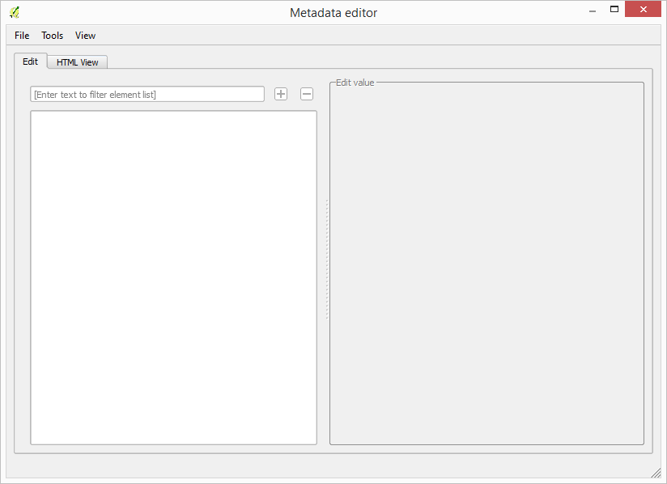
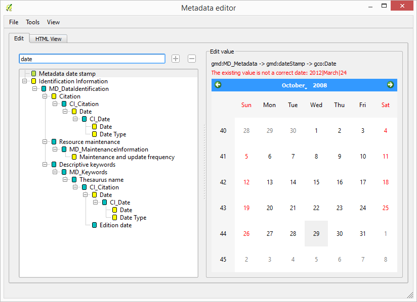
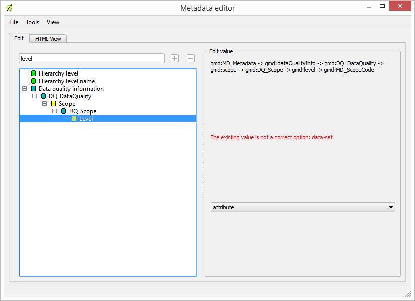
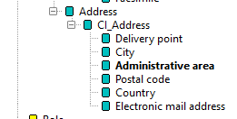
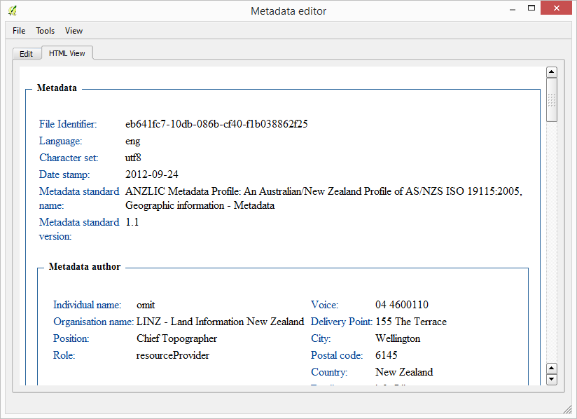

.. _metadata:

Editing/viewing layer metadata
==============================

Layer metadata can be edited for a given QGIS layer, selecting it in the *QGIS project* element and then selecting the *Edit/view layer metadata* action. This will open the metadata window, which, for a layer that has no previous metadata, looks like this:

	
The editor supports metadata in ISO-19115 format, and it can be used for both file-based layers and PostGIS layer. If your layer already has metadata, the metadata editor will open it and display it in a tree, as shown next.

.. image:: img/metadata/metadata_tree.png
	:align: center

If the metadata is not ISO-19115 or FGDC compliant, and is stored as XML, the tree structure will be created and you will be able to edit the elements it contains, but notice that certain features such as the HTML view or custom input element for certain data types will not be available. Only ISO-19115  format are fully supported. No validation is, however, performed when opening the metadata, even if one a supported format is recognised.

If your layer does not have any metadata, you can create it by using a template. In the *File/New* menu, select any of the available templates.

To edit the value of an element, just click on its name in the tree. The panel on the right-hand side of the window will show an input element adapted to the data type of the element.

In most cases, the value can be entered as a string in a text box.

.. image:: img/metadata/metadata_string.png
	:align: center

For certain data types, the correctness of the existing value (if it exists) is checked, and a warning message is displayed in case it is not correct, such as, for instance, a code value not included in the list of valid options or a date in a format that is not compliant with ISO-8601.

Once you have finished editing value elements, select the *File/Save* menu to save the metadata to the layer. Element values are not saved as you edit them, but only when the save command is invoked.

To find a given element, you can use the filter text box. Enter the name of the element in the text box and the tree will be filtered, so only those elements that include the specified string in their name will be shown.

.. image:: img/metadata/metadata_filter.png
	:align: center

To make it easier to locate the elements that do not have any value yet, you can enable the *Highlight empty fields* entry in the *View* menu.

.. image:: img/metadata/metadata_highlight.png
	:align: center

Elements with no value will be displayed in a bold type face.

Completing metadata using layer properties.
********************************************

Certain metadata values can be taken directly from the layer properties instead of typing them in the corresponding entry component. To do so, select the *Tools/Fill metadata from layer*. 

At the moment, the only fields that are completed are the ones describing the bounding box of the layer, that is:
       
- ``gmd:westBoundLongitude``
- ``gmd:eastBoundLongitude``
- ``gmd:southBoundLatitude``   
- ``gmd:northBoundLatitude``
       
Values have to be specified using geographic coordinates. If the layer uses a different CRS, the bounding box coordinates will be reprojected automatically.

Importing from a metadata file or layer
*****************************************

IF instead of creating your metadata from one of the available empty templates you want to use another template (for instance, one with certain fields already filled), you can do it by importing the template. There are two options, both of them found in the *File* menu

- *Import from file*: an XML file is selected and its content will be used as metadata of the current layer being edited.
- *Import from layer*: A list of all layers currently open in your QGIS project and containing metadata is shown. Select one of them to use its metadata for the current layer.

If you want to initialize several layer using a given template, there is no need to open them individually in the metadata editor and performing the above operation for each of them. Instead, just select all of them in the OpenGeo Explorer tree, and then right-click to show the context menu. 

The two options explained above are available, and the selected metadata (whether it comes from a file or from a layer) will be applied to the selected layer.

Displaying metadata
********************

To show a formatted HTML version of the data, select the HTML view tab in the metadata window. 

This option is only available for ISO-19115 metadata.