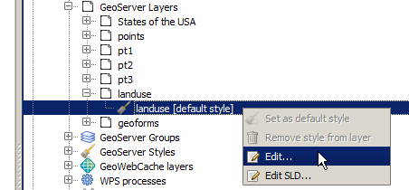
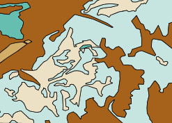
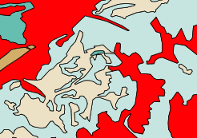

.. _quickstart:

Quickstart tutorial
===================

This tutorial will guide you through some of the most basic tasks that can be performed using the OpenGeo Suite QGIS plugin.

Prerequisites
-------------

This tutorial assumes that QGIS and the OpenGeo Suite QGIS plugin has been already installed. It also assumes a local GeoServer instance and a PostGIS database installed with the parameters set by a standard OpenGeo Suite installation:

 * GeoServer running on port 8080 and responding on ``http://localhost:8080/geoserver/``
 * PostGIS running on port 5432 

You may need to adapt the examples as needed to fit your specific installation.

Data
----

:download:`Download the example data <data/data.zip>` to be used in this tutorial. Extract this archive to a convenient directory.

Connecting to GeoServer
-----------------------

#. To start, open the OpenGeo Explorer by clicking the :guilabel:`OpenGeo` menu and selecting :guilabel:`OpenGeo Explorer`. The panel will appear on the right side of your QGIS window.

   .. figure:: img/quickstart/explorer.png

      OpenGeo Explorer

#. You will see that the :guilabel:`GeoServer catalogs` entry is empty. Click to select it and then click :guilabel:`New catalog`.

   .. note:: The buttons on the toolbar will change depending on the type of element selected in the tree.

#. The catalog creation dialog contains the default parameters for a local GeoServer instance.

   .. figure:: img/quickstart/create_catalog.png

      Default parameters

#. There is no need to modify the default values, so just click :guilabel:`OK`. The new catalog will appear in the :guilabel:`GeoServer catalogs` branch.

   .. figure:: img/quickstart/catalog_entry.png

      GeoServer catalog

Publishing a QGIS project
-------------------------

#. In order to publish data into that catalog (to GeoServer), the first thing to do is to create a workspace where we can put our data. Select the :guilabel:`GeoServer Workspaces` entry and then click :guilabel:`New workspace` in the toolbar.

#. Fill out the form in the dialog boxes with the inputs as shown above and click :guilabel:`OK`.

   * **Name**: ``quickstart``
   * **URI**: ``http://quickstart``

   .. figure:: img/quickstart/create_workspace.png

#. The new workspace should now appear in the list. It is not the default workspace, though, so to make it the default, select the workspace item, right-click and then select :guilabel:`Set as default workspace`. While not necessary, this will make the next few tasks a bit easier to perform.

   .. figure:: img/quickstart/default_workspace.png

#. Open the QGIS project that is included in the example data (:file:`quickstart.qgs`). There should be five layers in your project in two groups.

   This is what the project will look like in the QGIS Layers panel:

   .. figure:: img/quickstart/project.png

      Quickstart sample project

#. We will publish this project to GeoServer as it is, with those layers, groups, and the symbology associated with each layer.

   To publish the project as it is, just select the :guilabel:`QGIS project` entry in the OpenGeo Explorer tree, and then click :guilabel:`Publish...`. You will see the following dialog:

   .. figure:: img/quickstart/publish_project.png

#. Select the :guilabel:`quickstart` workspace as the destination workspace. Make sure the :guilabel:`Global group name` box is left blank. Click :guilabel:`OK` to start the publishing process.

#. Once finished, your catalog should look like this. 

   .. figure:: img/quickstart/catalog_after_publish.png

   As you can see, a store has been created for each QGIS layer, and also the corresponding GeoServer layers and styles. Layers have been configured to use the corresponding styles.

Publishing a shapefile
----------------------

The sample data contains a shapefile named :file:`pt4.shp` that was not included in the QGIS project. We will add it to the already-published content. It is not necessary to open/view the layer in QGIS to publish it to GeoServer.

#. Open the QGIS Browser (:menuselection:`View --> Panels --> Browser` if it is not already open) and locate the shapefile.

   .. figure:: img/quickstart/file_in_browser.png

#. Select the file and drag it onto the :guilabel:`GeoServer Workspaces` catalog item in the tree.

   .. figure:: img/quickstart/drag_file.png

   Since the ``quickstart`` workspace was set as the default, the layer will be added to that workspace. If you want to publish into another one, just drop it on the corresponding workspace item instead of the catalog one.

#. In this case, we want the layer to have the same style as the other layers we uploaded (which themselves all share the same styling), so we can reuse one of the uploaded styles. To change the style, select the layer in the :guilabel:`GeoServer Layers` (*not* :guilabel:`GeoServer Workspaces`) and then click the :guilabel:`Add style to layer` button. You will see the following dialog:

   .. figure:: img/quickstart/add_style.png

#. Select the :guilabel:`pt1` style in the list. Make sure to check the :guilabel:`Add as default style` option as well.

   .. note:: You can also accomplish the same action by dragging the :guilabel:`pt1` style onto the layer item. That will not make it the default style, but you can then select it and click the :guilabel:`Set as default style` button.

#. Having switched the style for our ``pt4`` layer to use the one from ``pt1``, we can now remove the original ``pt4`` style. This can be done by right-clicking the style and selecting :guilabel:`Remove style from layer`. You can also delete it from the catalog itself (as it is not used by any other layer) by clicking the ``pt4`` element in the :guilabel:`Styles` branch and then selecting the :guilabel:`Delete` action.

Editing a style
---------------

One of the most interesting features of the OpenGeo Suite QGIS plugin is that you can use QGIS to create your styles, without having to edit SLD code manually.

The sample project already has a style for each one of its layers, which was uploaded when we published the project to the GeoServer catalog. You can modify the style and then reimport it into the catalog, but you can also directly edit any GeoServer style without it being part of a QGIS project.

To edit the style of the ``landuse`` layer in GeoServer, locate the layer in the :guilabel:`GeoServer Layers` tree. Under it, you should see the list of styles associated with the layer. Right-click the style (also called :guilabel:`landuse`) and select the :guilabel:`Edit` option.

.. note:: There is also an :guilabel:`Edit SLD` option to edit the actual raw SLD, but that is a different task from this.

This will open the QGIS symbology dialog, where you can make the changes you want to your style. When you close it, the style in your GeoServer catalog will be updated.

To see this in action, let's make some small edits to this style:

#. Double click one of the rows (for example, :guilabel:`agricultural_areas`).

#. In the :guilabel:`Style properties` dialog, click the :guilabel:`Color` button and change the color.

#. Click :guilabel:`OK`.

#. Delete the bottom rule that contains :guilabel:`(no filter)`. Click to select it and click the :guilabel:`Delete` button (the red minus).

The style has been changed in GeoServer. This can be verified by right-clicking the same style and selecting :guilabel:`Edit SLD` and looking at the RGB value for the Polygon Fill of the ``agricultural_areas`` rule. It can also be viewed in GeoServer's Layer Preview.

.. note:: The style change will not be reflected in the QGIS viewing window, because it is reading from the local project and not from GeoServer.

   Original landuse style

   Changed landuse style

Publishing from PostGIS
-----------------------

There are other ways to publish data. Instead of creating GeoServer layers based on shapefiles, we can create layers based on database tables.

We will see this by first importing those shapefiles into a PostGIS database, and then creating layers.

#. First create a database named ``quickstart``. Make sure this database is spatially enabled.

   .. note:: The details of this step are beyond the scope of this tutorial, as it must be done outside of QGIS using PostgreSQL command-line utilities like ``psql`` or the ``pgAdmin`` utility. An example using the command line would look like this:

      .. code-block:: console

         createdb -U postgres quickstart
         psql -U postgres -d quickstart -c "create extension postgis;"

#. Connect to the database using the OpenGeo Explorer by right-clicking the :guilabel:`PostGIS connections` item in the tree and selecting :guilabel:`New connection`.

   .. figure:: img/quickstart/new_pg_connection.png

#. Set the parameters of the connection and click :guilabel:`OK`. The database should appear in the tree.

   .. figure:: img/quickstart/connection.png

#. Now click the schema where you want to import your data (default for a newly-created database is called ``public``, and select :guilabel:`Import files`. The following dialog will appear:

   .. figure:: img/quickstart/import_to_postgis.png

#. Click the button in the upper part of the dialog to select the files to import. Select the ``pt1.shp``, ``pt2.shp``, and ``pt3.shp`` files. Set the name of the destination table to :guilabel:`elevation`, and check the :guilabel:`Add to table (do not overwrite)` box. This will cause all files to be imported to a *single* table named ``elevation`` and not as three separate tables. The dialog should look like this.

   .. figure:: img/quickstart/import_to_postgis2.png

#. Click :guilabel:`OK` and the data will be imported.

   .. todo:: This doesn't work currently.

#. To create a GeoServer layer from that table, drag and drop the table onto :guilabel:`GeoServer Workspaces`, just like when importing the shapefile.

#. The resulting GeoServer layer will have no style associated. You can solve that by dropping a style onto the layer.

Publishing a TIF file
---------------------

Raster layers are published in a similar way to vector layers. The example data includes a raster layer named :file:`dem.tif`` that can be uploaded to GeoServer in the two ways we've seen before:

#. Drag file name from :guilabel:`Browser` to :guilabel:`GeoServer Workspaces`.

#. Add to the current project, then right-=click on layer in the :guilabel:`QGIS Layers` list and select :guilabel:`Publish`. 

In either case, a new coverage store will be created in the catalog, and the corresponding layer will be published.

Styling is also uploaded and set as the default style in the published layer. If publishing directly from the file, a default style will be used. Single-band layers will use a black-to-white color ramp, and all other layers are assumed to be 3-band RGB color images.

Caching
-------

Once data is in the GeoServer catalog, we can use the OpenGeo Explorer panel to seed the tile cache of a particular layer.

#. In the :guilabel:`GeoWebCache layers` entry, you should see something like this:

   .. figure:: img/quickstart/gwc.png

#. Click the layer that corresponds to the PostGIS-based layer (``elevation``). Right-click and select :guilabel:`Seed`. You will see a dialog to define the seeding task to perform, along with all parameters, as shown in the figure below:

   .. figure:: img/quickstart/seed_dialog.png

   .. todo:: Be explicit about details

#. Click :guilabel:`OK` to start the seeding process. The description panel of the layer entry will change to reflect that a seeding operation has been launched.

   .. figure:: img/quickstart/seed.png

#. The description is not updated automatically, but you can click the :guilabel:`Update` link to refresh and see how it progresses, or the :guilabel:`Kill` link to abort the seeding operation.

Preprocessing data
------------------

The layers to upload sometimes require preprocessing, for instance if they are not in the optimal format to provide the best performance once they are published. This preprocessing can be performed independently before publishing, but can also be included as part of the publishing operation itself.

The OpenGeo Explorer integrates with the QGIS Processing Framework and allows you to define a process to be run on any layer before uploading it, publishing the resulting *processed* layer instead.

Processes are defined using the QGIS processing graphical modeler or as python scripts, and the process to use is specified in the Explorer configuration.

The sample data zip file contains an example hook that can be used for vector layers. It will export the selected features to a new layer, so only those features will be later uploaded. If the layer you are uploading is not open in QGIS (such as when you export dragging it directly from the QGIS browser), the hook will have no effect at all (since it is not open, a selection does not exist). If, however, the layer is loaded and a selection exists, only the selected features will be uploaded. If no features are selected, the whole layer will be uploaded. 

Follow these steps to enable the upload hook

#. Open the OpenGeo Explorer configuration dialog from the OpenGeo menu.

   .. figure:: img/quickstart/config.png

#. Find the :guilabel:`Vector preprocessing hook file` parameter. The data file that you downloaded contains an example model named ``vector_hook.py``. Locate it and enter the path to it as value of the parameter. This will cause the model to be run before the data is uploaded, and the resulting output to be imported instead of the original layer.

#. Make a selection in one of the project layers and upload it to GeoServer. The preprocessing hook will be run before the upload and only the selected features will be uploaded. To disable it for future uploads, just go to the configuration and change the value of the corresponding value to an empty string, so it doesn't point to any valid model or script file.

