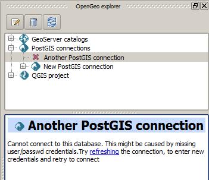

.. _actions.postgis:

PostGIS Connections actions
===========================

The functionality in the PostGIS branch is similar to that of the QGIS DB Manager, but with some additional operations and integrated with the other elements that can be managed from OpenGeo Explorer. It contains the list of connections currently available in QGIS.

If passwords were not stored when the DB connection was created, the connection will not be possible, and the corresponding tree element will not be populated with the available schemas. This is indicated with a different icon in the connection element.

   Bad connection

To reconnect a wrong connection, select the :guilabel:`Refresh` option. You will be prompted for the user name and password, and a new attempt will be made to connect to the PostGIS database.

.. figure:: img/db_credentials.png

   Database credentials

The following actions are available for items in the PostGIS branch:

PostGIS Connections
-------------------

.. list-table::
   :header-rows: 1
   :stub-columns: 1
   :widths: 20 80
   :class: non-responsive

   * - Action
     - Description
   * - Refresh
     - Updates the contents of the database list.
   * - Add new connection
     - Adds a new PostGIS connection. The connection is not defined through the usual QGIS connection dialog, but a custom one:

       .. image:: img/new_pg_connection.png
    
       At the moment, this dialog does not allow to configure all the parameters that can be set up through the built-in dialog. Also, passwords and user names are always stored in this case. If this doesn't fit your needs, create the new connection through the usual interface, using the :guilabel:`Add PostGIS layers` menu entry and then creating a new connection. Then refresh the :guilabel:`PostGIS connections` entry, since it will not be automatically updated. 

PostGIS connection
------------------

.. list-table::
   :header-rows: 1
   :stub-columns: 1
   :widths: 20 80
   :class: non-responsive

   * - Action
     - Description
   * - Refresh
     - Updates the contents of the connection entry.
   * - Edit
     - Edits the connection parameters of the PostGIS connection. This also alters the definition of the connection in the general list of PostGIS connections kept by QGIS, not just for OpenGeo Explorer. You can also edit this using the :guilabel:`Add PostGIS layers` QGIS command, but the tree will need to be manually refreshed.

       When a connection is edited using OpenGeo Explorer, the user name and password are stored. Use the QGIS UI instead if you want to edit the connection but not store the password. You will need to enter it each time you start the Explorer or refresh the PostGIS branch in the OpenGeo Explorer tree.
   * - Remove
     - Removes the database from the list.
   * - New schema
     - Creates a new schema. You will be prompted to enter the name for the new schema in an input box.
   * - Run SQL
     - Opens the DB manager SQL dialog, where SQL commands can be entered and run.

       .. image:: img/runsql.png

   * - Import files
     - Imports a set of files with data into the selected schema. The following window is shown:

       .. image:: img/import_postgis.png

       Click the button in the :guilabel:`Layers` group and select the files you want to import, then select the destination schema and table. You can select the name of a preexisting table or enter a new name. In case of selecting a preexisting table, click the :guilabel:`Add to table` checkbox can append the imported data to the existing content of the table. Otherwise, the table will be deleted and a new one with that name created.

       If you select the :guilabel:`Add to table` box, data will only be imported if the feature type of the file to import matches the table feature type. If not, an error message will be shown in the log window and the corresponding file will not be imported.

       There is an additional option, :guilabel:`[use file name]`, which will set the table name based on the name of the file to import (without extension). The :guilabel:`Add to table` box applies also in this case.

       When two or more files are selected, the :guilabel:`Add to table` box will automatically be checked in case a table name option other than :guilabel:`[use file name]` is selected.

       When using the :guilabel:`Add to table` option, all imported layers should have a feature type compatible with that of the table to which they are going to be added. If feature types are not compatible, PostGIS will refuse to add the layer and raise an error.

       This command supports only vector layers.

       You can check "Import as single geometries" box to force all geometries to be imported as single geometries instead of multi-geometries. All features with multiple geometries will be automatically converted.

       If the import is done using the :guilabel:`Add to table` option, the import relies on the ``shp2pgsql`` utility, which will need to be installed and on the ``PATH``.
     
PostGIS schema
--------------

.. list-table::
   :header-rows: 1
   :stub-columns: 1
   :widths: 20 80
   :class: non-responsive

   * - Action
     - Description
   * - Refresh
     - Updates the contents of the schema.
   * - New table
     - Creates a new table. The table definition is done in the following dialog:

       .. image:: img/create_table.png
   * - Delete
     - Deletes the schema. It must be empty before it can be removed.
   * - Rename
     - Renames the schema.
   * - Import files
     - Same as the import command for connection items, but the schema field in the import dialog is not enabled.

PostGIS table
-------------

.. list-table::
   :header-rows: 1
   :stub-columns: 1
   :widths: 20 80
   :class: non-responsive

   * - Action
     - Description
   * - Refresh
     - Updates the contents of the table.
   * - Publish
     - Loads the table as a store and layer in a GeoServer catalog. You can specify the target workspace and the layer name.
   * - Delete
     - Deletes the table.
   * - Rename
     - Renames the table.
   * - Edit
     - Opens the DB manager table edit dialog, which allows for editing of the structure of the table and its properties.

       .. image:: img/edit_table.png
     
   * - Vacuum analyze
     - Performs the SQL VACUUM ANALYZE operation on the table.
