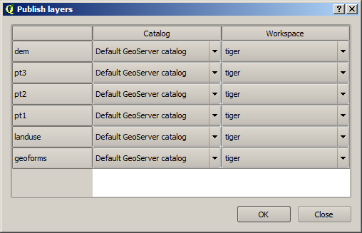

.. _usage:

Usage
=====

This page discusses the basics of interacting with OpenGeo Explorer. For common functionality, please see the :ref:`tutorial` page. For a comprehensive reference of all possible options, please see the :ref:`actions` section.

Main panel
----------

OpenGeo Explorer is launched from the :guilabel:`OpenGeo` menu:

   .. figure:: ../actions/img/plugin_menu.png

      OpenGeo Explorer menu

This brings up a panel in QGIS. The main element of this panel is the tree. It has the following main branches, each of which deals with a different component:

* The **GeoServer Catalogs** branch contains a list of the catalogs of all connected GeoServer instances. Once instances are added to this branch, you can interact with this GeoServer form within this panel, including publishing layers and styles, and creating caches.
* The **PostGIS Databases** branch contains a list of all connected PostGIS databases. Its functionality resembles that of the DB Manager in QGIS. Once databases are added here, you can interact with them from within this panel, including viewing and adding tables.
* The **QGIS Project** branch contains the elements of the current QGIS project.

.. note:: The elements in the QGIS Project branch are presented with a structure that more resembles the elements in GeoServer, making publishing easier.

The lower part of the panel contains an information window showing the description of the currently selected item, and also contains links to actions that are related to the current element. 

.. figure:: img/description_panel.png

   Description panel

.. note:: When the panel is undocked, the information window appears to the right of the tree.

   .. figure:: img/undocked.png

The information window can also show tables where parameters can be edited. The one shown below corresponds to the :guilabel:`Settings` element of a GeoServer catalog.

.. figure:: img/description_table.png

Accessing the functionality of OpenGeo Explorer is done through context menus (right-clicking), or through the buttons in the toolbar above the tree. These buttons change depending on what is selected, and are identical to the items found in the context menu.

Batch processing with multiple selections
-----------------------------------------

You can select multiple elements of the same type (such as multiple QGIS layers or multiple GeoServer layers, etc.) to automate operations.

Selecting multiple elements can be done by clicking while pressing :kbd:`Ctrl/Cmd` or :kbd:`Shift`. Selecting an action with multiple elements selected will set that action for every element.

For example, to publish multiple QGIS layers at once, select them all, then select the :guilabel:`Publish` action. You will see a dialog like this:

   Publishing multiple layers

This is similar to the dialog that appears when publishing a group to a GeoServer catalog, however, in this case, there is more flexibility, so an additional column is shown which can be used to select the catalog for each layer. Changing the selected catalog at a given row will automatically update the list of workspaces in that row, so it contains the workspaces of that catalog.

.. note:: If only one catalog exists in the Explorer tree, the catalog column will not be shown.

Configure the catalog (if available) and workspace where you want to upload each layer, and then a multiple upload will be executed.

Double-clicking items to edit
-----------------------------

If an element has an Edit action associated with it (such as a GeoServer group), this action can be invoked by double-clicking on the element in the tree.

Drag and drop operations
------------------------

Inside OpenGeo Explorer
~~~~~~~~~~~~~~~~~~~~~~~

The OpenGeo Explorer tree supports drag and drop. You can use this to relocate elements, publish data or edit the configuration of an element.

.. figure:: img/dragdrop.png

   Drag and drop

.. note:: Multiple elements can be selected and dragged, as long as they are of the same type.

Below are some of the actions that can be performed via drag and drop:

* Dragging a QGIS layer item onto a GeoServer item element will publish the layer to the workspace where the item was dropped, or the default workspace if not specified.
* Dragging a GeoServer layer item onto a GeoServer group element will add the layer to the group, using its default style.
* Dragging a style item onto a GeoServer layer will add the style to the list of alternative styles of the layer.
* Dragging a QGIS style into the Styles element of a catalog will add the style to that catalog.
* Dragging a QGIS group element into the Groups, Workspaces, or Layers of a GeoServer catalog will publish the group and its contents. If dropped on a workspace item, that workspace will be used as destination.
* Dragging a GeoServer layer item onto the :guilabel:`GeoWebCache layers` item of the same catalog will add the corresponding cached layer for the dragged layer.
* Dragging a QGIS layer into a PostGIS connection or schema item will import the layer into the corresponding PostGIS database. The import dialog will be shown before importing.
* Dragging a QGIS layer into a PostGIS table item will append the dragged layer to the existing table. No checking is performed, so the schema of the imported layer should match the schema of the table.
* Dragging a PostGIS table item into a GeoServer catalog or workspace item will publish a new layer based on that table, using the item workspace or the default workspace if not specified.

From QGIS to OpenGeo Explorer
~~~~~~~~~~~~~~~~~~~~~~~~~~~~~

You can also drag elements from outside of the OpenGeo Explorer itself. For instance, you can drag elements from the QGIS Browser directly into a PostGIS database or GeoServer catalog element. That will cause the data in those files to be imported into the corresponding database or catalog. Format conversion will be performed automatically if needed.

.. figure:: img/dragdrop_external.png

   Drag and drop from an external source

.. note:: If the dragged files are not opened in the current QGIS project, no style will be uploaded when publishing to a GeoServer catalog.

In general, any operation that can be performed dragging a QGIS layer item within the Explorer tree can also be performed dragging an element in the QGIS browser that represents a layer.

From OpenGeo Explorer to QGIS
~~~~~~~~~~~~~~~~~~~~~~~~~~~~~

Elements from OpenGeo Explorer can also be dropped onto the QGIS canvas.

GeoServer layers can be dropped onto the QGIS canvas to add them to the project. Because the connection will be using WFS or WCS, the style of the layer will not be used, and instead there will be a default style assigned to it.

Dragging and dropping a PostGIS table will cause a new layer to be added to the QGIS project based on that table.

Preprocessing data
------------------

Layers to upload sometimes require preprocessing. An example of this is when a layer is not in an optimal format for best performance once published. This preprocessing can be performed independently before publishing, but can also be included as part of the publishing operation itself.

The OpenGeo Explorer integrates with the QGIS Processing Framework and allows you to define a process to be run on any layer before uploading it, publishing the resulting *processed* layer instead.

Processes are defined using the QGIS processing graphical modeler or as python scripts.

Preprocessing hooks can be set in the :ref:`config` section, specifying :guilabel:`Vector preprocessing hook file` or :guilabel:`Raster preprocessing hook file`.

:download:`The example data <../data/quickstart_data.zip>` contains a hook that can be used for vector layers. It will export selected features to a new layer, so only those features will be later uploaded. If no features are selected, the whole layer will be uploaded. This hook only will apply if the layer is open in QGIS.

